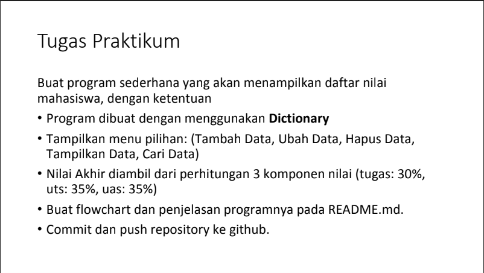
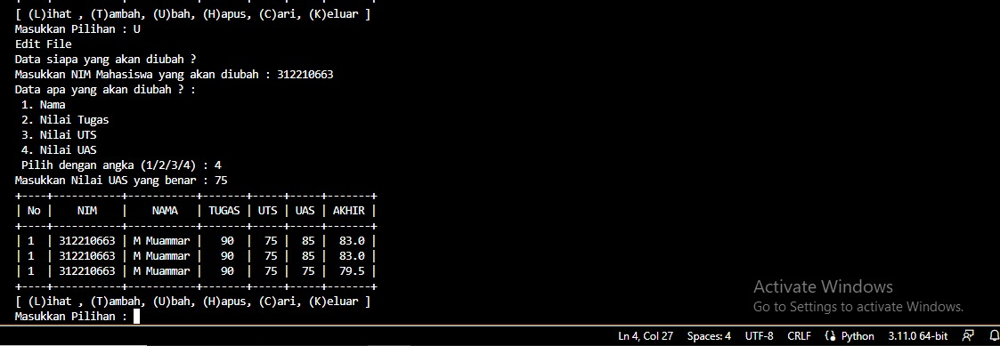

## Pertemuan10-praktikum5
----
Repository ini dibuat untuk memenuhi tugas pertemuan 10- Bahasa pemrograman(Module Praktikum 5)

Nama : M Muammar
NIM  : 312210663
Dosen : Agung Nugroho, M.Kom
Matkul : Bahasa pemrogramanKelas : TI.22.B1

Pada halaman ini(tugas Pertemuan9-Module Praktikum 5) Dosen memberi tugas sebagai berikut:

- Soal Ltihan yang ada pada module praktikum 5
 

- Berikut adalah syntax yang saya buat untuk memenuhi latihan module 5

- ini adalah hasil run dari syntax latihan module 5 yang saya buat

- Soal Tugas Praktikum yang ada pada module 5 adalah sebagai berikut:

- Berikut hasil yang diinginkan pada soal praktikum 5

- Setelah memehami materi saya membuat syntax sebagai berikut untuk memenuhi tugas praktikum module 5:

- Berikut ini adalah hasil run dari syntax diatas akan diuraikan satu persatu 
- lihat data sebelum data ditambahkan

- Tambah data 

- Lihat setelah tambah data

- Ubah data, dan pada gambar dibawah adalah hasil dari perubahan data

- Mencari data yang diinputkan 

- Menghapus data yang diinputkan 

- Keluar dari program aplikasi

## Berikut langkah-langkah untuk tugas pertemuan10 Module5.

## _otsukaresamadeshita_

